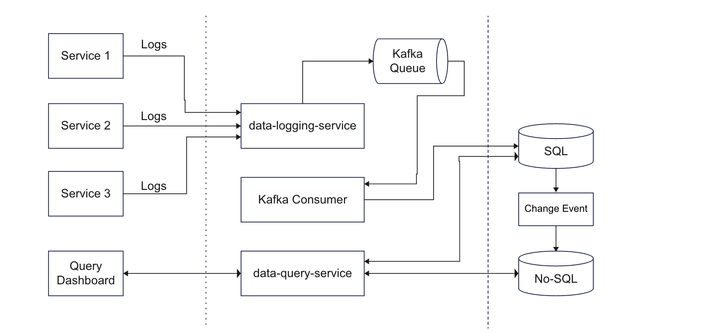
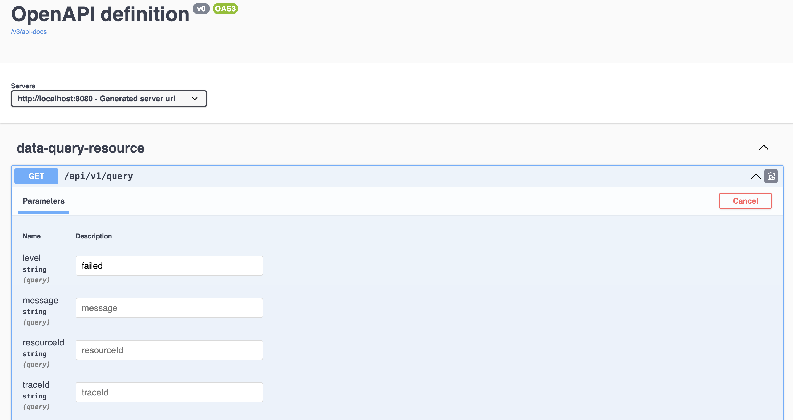

# Log Ingestor and Query Application
I have developed a log ingestor system that can efficiently handle vast volumes of log data, and I have also built a simple interface for querying this data using full-text search and specific field filters.

### Architecture Diagram

- The logs ingested by different services are processed by the data-logging-service
- The data-logging-service pushes all the logs to a Kafka Queue
- A Kafka consumer consumes these logs and sends them to a PSQL Db
- data-query-service exposes various APIs to filter and query data from the PSQL Db and with change event, data will be sync to ElasticSearch db
- A frontend dashboard makes API calls to data-query-service and displays results

### Tech Stack

[](https://spring.io/)
[](https://kafka.apache.org/)
[](https://www.postgresql.org/)
[](https://www.elastic.co/)


### Database Design
#### Postgre PSQL Table: Logs
```CREATE TABLE Logs (
    LogID SERIAL PRIMARY KEY,
    Level VARCHAR(50),
    Message VARCHAR(255),
    ResourceID VARCHAR(100),
    Timestamp TIMESTAMP,
    TraceID VARCHAR(100),
    SpanID VARCHAR(100),
    Commit VARCHAR(50),
    MetadataID INT
);

CREATE INDEX idx_logs_timestamp ON Logs (Timestamp);
CREATE INDEX idx_logs_metadataid ON Logs (MetadataID);
CREATE INDEX idx_logs_resource ON Logs (ResourceID);
CREATE INDEX idx_logs_trace ON Logs (TraceID);
CREATE INDEX idx_logs_span ON Logs (SpanID);
CREATE INDEX idx_logs_level ON Logs (Level);
CREATE INDEX idx_logs_commit ON Logs (Commit);
```
#### Postgre PSQL Table: Metadata
```CREATE TABLE Metadata (
    MetadataID SERIAL PRIMARY KEY,
    ParentResourceID VARCHAR(100)
);

CREATE INDEX idx_metadata_parentresourceid ON metadata (parentresourceid);
```
* Indexed Columns for Filtering: Indexes on key columns (ResourceID, TraceID, SpanID, Level, Commit) enable swift querying based on specific attributes, enhancing the system's responsiveness.
* The Metadata table provides a scalable solution for accommodating an increasing variety of metadata attributes for future requirements without the need for altering the main log table.
* I have found that PostgreSQL is faster than MySQL when dealing with massive datasets because it supports concurrent writing operations without the need for read/write locks and thus a good fit for this project.

#### ElasticSearch
Full-Text Search on Message Column: Elasticsearch excels in full-text search scenarios. Integrating Elasticsearch and indexing the Message column will significantly enhance the speed and efficiency of queries based on log message content, providing superior search capabilities compared to traditional PSQL databases. (To be implemented...)

### Backend Design
In designing the backend, I've employed a multi-module Spring Boot project for meticulous code organization and optimal code reuse. The components are structured as follows:

Data Logging Service: The data-logging-service module serves as the log ingestor, exposing an API to receive logs.
All incoming logs are efficiently directed to Kafka for further processing.

Kafka Integration: The Kafka module is dedicated to configuring seamless integration with Kafka.
It encapsulates essential configurations for services, encompassing both Kafka Producer and Consumer functionalities.

PSQL Data Persistence: The sql-data-persistence module acts as a crucial intermediary.
It bridges the business logic of the query service with the underlying database, facilitating the execution of various database queries.

Data Query Service: The data-query-service module exposes a set of APIs designed for querying and filtering log data.
This component serves as the interface for retrieving specific information from the database based on user-defined parameters.

This modular architecture ensures a clean separation of concerns, promoting scalability, maintainability, and streamlined development practices. Each module contributes to a well-orchestrated backend system capable of efficiently handling log ingestion, processing, and retrieval.

### Query Interface

The system supports log filtering based on the following parameters.
Note That the filter can be a single as well as a combination of any number of parameters:
- level
- message
- resourceId
- traceId
- spanId
- commit
- fromDate
- toDate


### APIs Exposed

#### For Log Ingestor
```
Request Type - POST 
EndPoint - http://localhost:9001/logs
Body - 
    {
	    "level": "error",
	    "message": "Failed to connect to DB",
        "resourceId": "server-1234",
	    "timestamp": "2023-09-15T08:00:00Z",
	    "traceId": "abc-xyz-123",
        "spanId": "span-456",
        "commit": "5e5342f",
        "metadata": {
            "parentResourceId": "server-0987"
        }
    }
```

#### For Querying Log Data
NOTE: This endpoint is dynamic and work with multiple filters as well.
```
Request Type - GET
EndPoint - http://localhost:8080/api/v1/query?level=failed&message=Failed&resourceId=server-123456&traceId=abc-xyz-1234&spanId=span-456&commit=5e5342fgh8
```

### Installation

#### 1. Java Development Kit (JDK)

Download and install the JDK from [AdoptOpenJDK](https://adoptopenjdk.net/). Follow the installation instructions for your operating system.

#### 2. Apache Maven

Download and install Apache Maven from [Maven](https://maven.apache.org/download.cgi). Follow the installation instructions for your operating system.

#### 3. Apache Kafka

Download and extract Apache Kafka from [Kafka Downloads](https://kafka.apache.org/downloads). Follow the installation instructions for your operating system.

#### 4. PostgreSQL

Download and install PostgreSQL from [PostgreSQL Downloads](https://www.postgresql.org/download/). Follow the installation instructions for your operating system.

#### 5. Clone Repository

Clone the repository using the following command:

```
git clone https://github.com/dyte-submissions/november-2023-hiring-deeppatel23.git
cd november-2023-hiring-deeppatel23/logging-and-query-system 
```

### Strengths of the System:
#### Volume Handling:

* Efficient Data Ingestion: The system excels in handling massive log volumes through a well-orchestrated process. Logs are efficiently ingested into PSQL via the data-logging-service, leveraging Kafka's high-throughput capabilities.

#### Speedy Search Results:
* Structured Query Optimization: The PSQL data persistence module optimizes structured queries, ensuring rapid retrieval of relevant data.
* Planned Elasticsearch Integration: Future integration with Elasticsearch, a NoSQL database optimized for full-text search, will significantly enhance the system's speed in returning search results.
  Scalability:

#### Horizontal Scalability:
* Kafka's scalability and fault-tolerance support the system's ability to scale horizontally. Additional nodes can be seamlessly added to Kafka and the PSQL database to accommodate increasing log volumes and query demands.
* Elasticsearch for Full-Text Queries: The planned integration of Elasticsearch as a NoSQL database specifically caters to full-text query needs, ensuring scalability and adaptability to evolving requirements.

### Future Enhancements

* Real-Time Monitoring and Alerts: Implement a real-time monitoring system to detect anomalies or critical events in the log data.
  Introduce alerting mechanisms to notify stakeholders or administrators about specific log patterns or issues.

* Elasticsearch Integration: Complete the planned integration with Elasticsearch for efficient full-text search capabilities on log messages.

* User Authentication and Authorization: Define roles and permissions to control which users can execute certain queries or access specific log entries.

### Demo
[](https://youtu.be/vhMLkbmORoA "Logging ingestion and quering")
